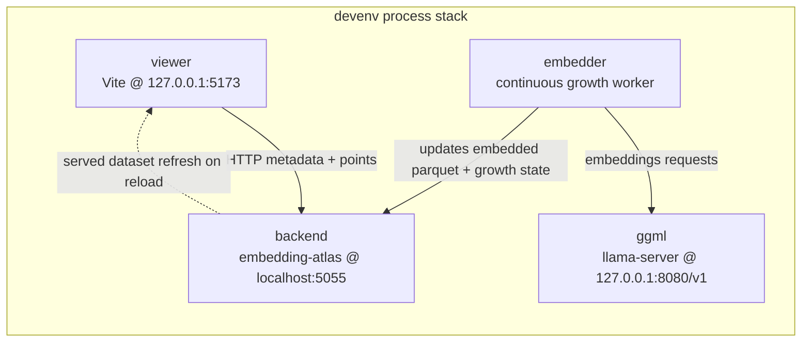
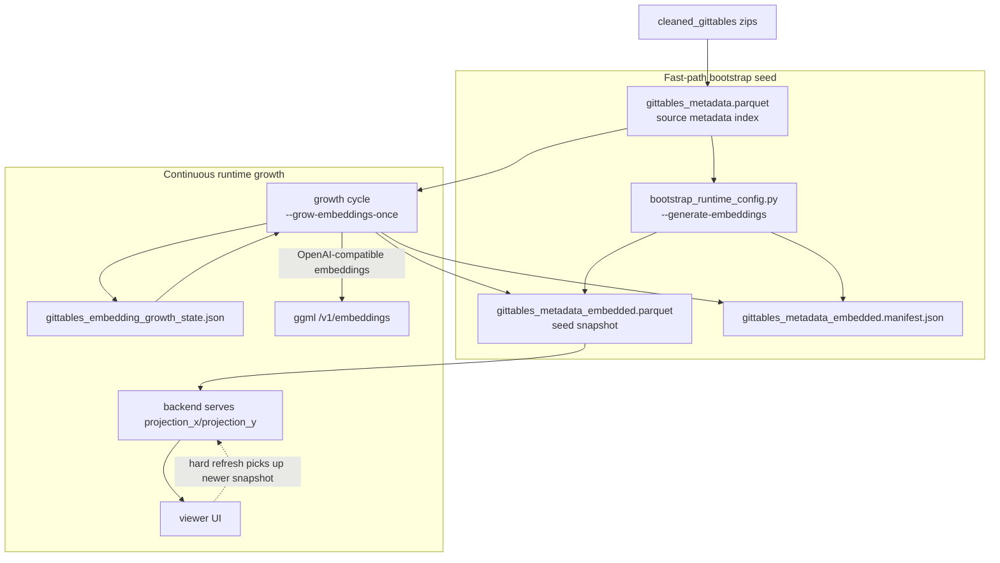

# Embedding Atlas `devenv` Runtime Guide

This document describes the local `devenv` stack used for fast UI startup with real embeddings, plus continuous background embedding growth while the stack is running.

## Goals

- Start the UI quickly with a **real-embeddings seed dataset**.
- Keep the UI responsive while embedding coverage grows in the background.
- Make progress visible in `devenv up` TUI logs.
- Keep all embedding generation idempotent and resumable.

## Stack Processes

Defined in `devenv.nix`:

- `llama`: runs `llama-server` (OpenAI-compatible embeddings endpoint).
 - `ggml`: runs `llama-server` (OpenAI-compatible embeddings endpoint from the ggml project).
- `viewer`: Vite dev server on `127.0.0.1:5173`.
- `backend`: `embedding-atlas` server on `localhost:5055`, serving a precomputed embedded parquet.
- `embedder`: background worker that continuously expands embedding coverage aperture.



Legend:

- `viewer`: browser-facing UI process.
- `backend`: serves metadata/points from embedded parquet.
- `embedder`: background aperture-growth worker.
- `ggml`: embedding model endpoint.
- Dashed edge: behavior that requires UI reload to observe updated snapshot.

## Data Artifacts

Primary runtime paths (default):

- Source metadata dataset: `build/datasets/gittables_metadata.parquet`
- Embedded dataset served by backend: `build/datasets/gittables_metadata_embedded.parquet`
- Embedded dataset manifest (idempotence): `build/datasets/gittables_metadata_embedded.manifest.json`
- Growth state/progress checkpoint: `build/datasets/gittables_embedding_growth_state.json`
- Runtime env/profile output: `build/runtime.generated.env`
- Runtime config output: `build/runtime.generated.conf`

## Startup Flow (Fast Path)

When `devenv up` starts:

1. `viewer`/`backend` run bootstrap (`scripts/bootstrap_runtime_config.py`) in seed mode (`--generate-embeddings`) to ensure a valid embedded dataset exists.
2. Bootstrap derives tuning knobs from first principles using detected hardware (`cpu_logical_cores`, `ram_gb`, `gpu_count`, and GPU memory):
  - throughput proxy drives sample size/modulo and growth pace,
  - memory proxy drives `ATLAS_LLAMACPP_BATCH_SIZE`, `ATLAS_LLAMACPP_CTX_SIZE`, and `ATLAS_EMBED_MAX_CHARS`,
  - profile-specific bounds keep values in safe operating ranges.
3. The seed step is idempotent:
   - input/source fingerprint + config digest is checked,
   - unchanged runs skip regeneration.
4. `backend` serves the embedded parquet using `projection_x` / `projection_y` directly.
5. `viewer` starts and loads quickly from the seed dataset.

## Continuous Growth Flow

While stack is running, `embedder` loop does:

1. Reads growth checkpoint (`gittables_embedding_growth_state.json`).
2. Advances deterministic aperture (`threshold += growth_step`, capped by modulo).
3. Regenerates embedded dataset for the expanded aperture (`--grow-embeddings-once`).
4. Writes updated manifest and growth state atomically.
5. Sleeps for `ATLAS_EMBED_GROWTH_SLEEP_SECONDS`, repeats.

A hard refresh is enough to observe newly included data as the dataset expands.



Legend:

- `META`: source metadata index used for embedding generation.
- `BS` seed path: fast startup snapshot generation.
- `GW` runtime path: incremental growth cycles while stack is up.
- `ST` + `MAN`: resumability + idempotence tracking artifacts.
- Dashed edge: refresh boundary for seeing expanded coverage in UI.

## Progress and Observability

Watch in TUI (`devenv up`) or logs (`.devenv/processes.log`).

Typical `embedder` lines:

- `cycle planning: aperture A->B/M`
- `cycle start: ... target rows +N (... remaining=R) | groups +G (... remaining=RG)`
- `retry batch at row I: batch_size X->Y, max_chars C->D`
- `generated embeddings dataset: ... (X rows)`
- `aperture B/M | rows +N (... remaining=R) | groups +G (... remaining=RG)`
- `coverage complete at aperture ...`

These provide:

- **new rows this cycle**,
- **total rows included**,
- **rows remaining**,
- **new/total/remaining zip groups** (when `zip_file` exists).

## Important Environment Knobs

### Core

- `ATLAS_BOOTSTRAP_ENABLED` (default `1`)
- `ATLAS_BOOTSTRAP_ENV_FILE` (default `build/runtime.generated.env`)
- `ATLAS_DATASET` (source metadata parquet)
- `ATLAS_EMBEDDED_DATASET` (served embedded parquet)

### Seed Embedding (fast start)

- `ATLAS_EMBED_SAMPLE`
- `ATLAS_EMBED_SAMPLE_MODULO`
- `ATLAS_EMBED_MAX_CHARS`
- `ATLAS_EMBED_BATCH_SIZE`
- `ATLAS_EMBED_RETRY_MIN_CHARS` (default `128`)
- `ATLAS_EMBED_RETRY_MAX_ATTEMPTS` (default `8`)

### Background Growth

- `ATLAS_EMBED_GROWTH_ENABLED` (default `1`)
- `ATLAS_EMBED_GROWTH_MODULO`
- `ATLAS_EMBED_GROWTH_STEP`
- `ATLAS_EMBED_GROWTH_SLEEP_SECONDS`
- `ATLAS_EMBED_GROWTH_MAX_THRESHOLD` (optional cap)
- `ATLAS_EMBED_GROWTH_STATE` (state checkpoint file)

### ggml (llama.cpp binary compatibility)

Note: environment variable names remain `ATLAS_LLAMACPP_*` for backward compatibility.

- `ATLAS_LLAMACPP_API_BASE` (default `http://localhost:8080/v1`)
- `ATLAS_LLAMACPP_MODEL`
- `ATLAS_LLAMACPP_LITELLM_MODEL`
- `ATLAS_LLAMACPP_CTX_SIZE`
- `ATLAS_LLAMACPP_BATCH_SIZE`
- `ATLAS_LLAMACPP_STARTUP_TIMEOUT`

## Day-to-Day Commands

Start stack:

```bash
devenv up
```

Detached mode:

```bash
devenv up -d
```

Stop stack:

```bash
devenv processes down
```

Tail logs:

```bash
tail -f .devenv/processes.log
```

Check key endpoints:

```bash
curl -sS -D - http://localhost:5055/data/metadata.json -o /dev/null
curl -sS -D - http://127.0.0.1:5173/ -o /dev/null
```

## Tuning Guidance

- Use the bootstrap script on each target machine to discover baseline knobs from hardware:

```bash
.devenv/state/venv/bin/python scripts/bootstrap_runtime_config.py --print-json
```

- Treat generated values as machine-specific defaults, then override selectively for experiments.
- Keep seed small (`ATLAS_EMBED_SAMPLE`) for startup speed.
- Increase growth pace by raising:
  - `ATLAS_EMBED_GROWTH_STEP`
  - decreasing `ATLAS_EMBED_GROWTH_SLEEP_SECONDS`
- If local hardware is constrained, reduce:
  - `ATLAS_EMBED_BATCH_SIZE`
  - `ATLAS_EMBED_MAX_CHARS`
  - `ATLAS_LLAMACPP_BATCH_SIZE`

## Troubleshooting

### No embedder progress in logs

- Ensure `ATLAS_EMBED_GROWTH_ENABLED=1`.
- Check `.devenv/processes.log` for `[embedder]` lines.
- Validate ggml endpoint/model:
  - `curl http://127.0.0.1:8080/v1/models`

### Backend starts but data is stale

- Confirm growth state is advancing:
  - `build/datasets/gittables_embedding_growth_state.json`
- Hard refresh browser to pick up new dataset snapshot.

### Stale process-compose socket issues

If `devenv up -d` attach/start fails unexpectedly:

```bash
devenv processes down || true
rm -f .devenv/process-compose/*
devenv up -d
```

## Implementation Files

- `devenv.nix`
- `scripts/bootstrap_runtime_config.py`
- `config/runtime.template.conf`
